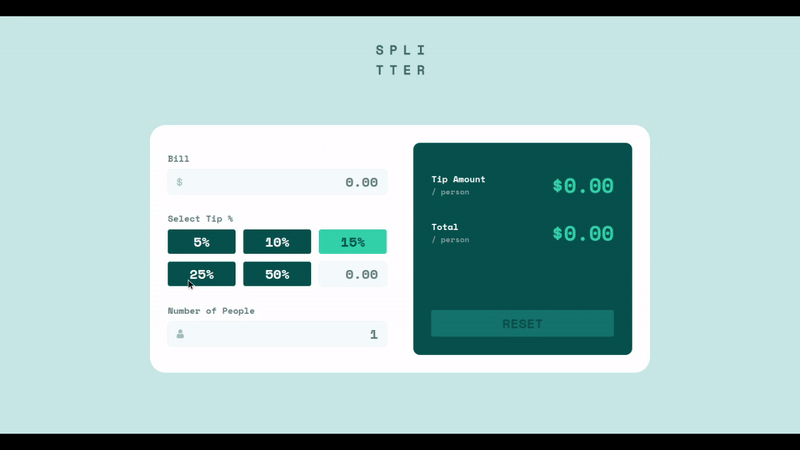
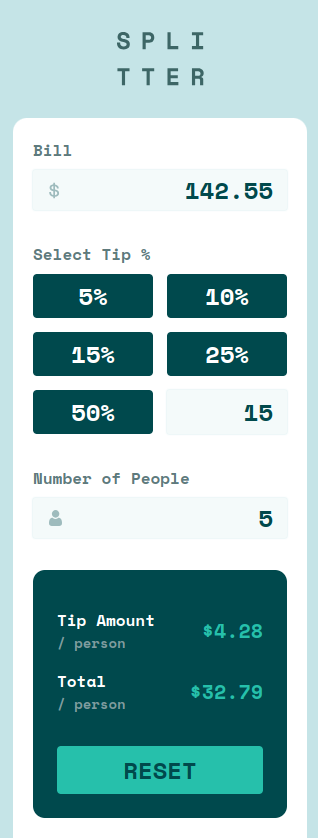
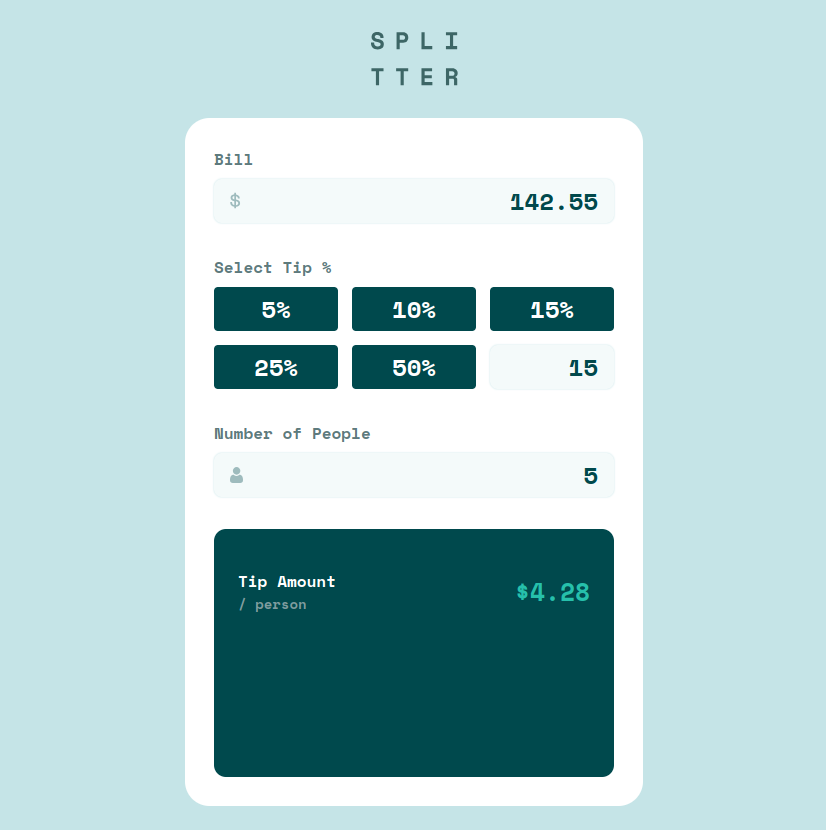

  

  <h2 align="center">Tip calculator app solution</h2>
  

    <a href="https://www.frontendmentor.io/challenges/tip-calculator-app-ugJNGbJUX">
      <strong>Frontend Mentor Challenge</strong>
    </a>
     
     
    <a href="https://alberto-rj.github.io/tip-calculator">Preview site</a>
    &nbsp;·&nbsp;
    <a href="https://github.com/alberto-rj/tip-calculator/issues">Report Bug</a>
    &nbsp;·&nbsp;
    <a href="https://github.com/alberto-rj/tip-calculator/issues">Request Feature</a>
  

<!-- Badges -->

  <!-- Profiles -->
   &nbsp;&nbsp;&nbsp;

  <!-- Status -->
   &nbsp;&nbsp;&nbsp;

  <!-- Difficulty -->
  

 
 

## Demo

<h3>Other devices</h3>

 

<strong>Mobile</strong>

 

<strong>Tablet</strong>

### Links

- [Preview site](https://alberto-rj.github.io/tip-calculator)
- [Preview solution on Frontent Mentor](https://www.frontendmentor.io/solutions/animated-tip-calcutor-app-using-sass-qxM5pUiJDC)

## The challenge

Users should be able to:

- View the optimal layout for the app depending on their device's screen size
- See hover states for all interactive elements on the page
- Calculate the correct tip and total cost of the bill per person

## Languages and Tools

 &nbsp;&nbsp;
 &nbsp;&nbsp;
 &nbsp;&nbsp;
 &nbsp;&nbsp;
 &nbsp;&nbsp;
 &nbsp;&nbsp;

## Author

- GitHub - [@alberto-rj](https://www.github.com/alberto-rj)
- Frontend Mentor - [@alberto-rj](https://www.frontendmentor.io/profile/alberto-rj)
- Twitter - [@albertorauljose](https://www.twitter.com/albertorauljose)

## Acknowledgments

Challenge was provided by [Frontend Mentor](https://www.frontendmentor.io).
