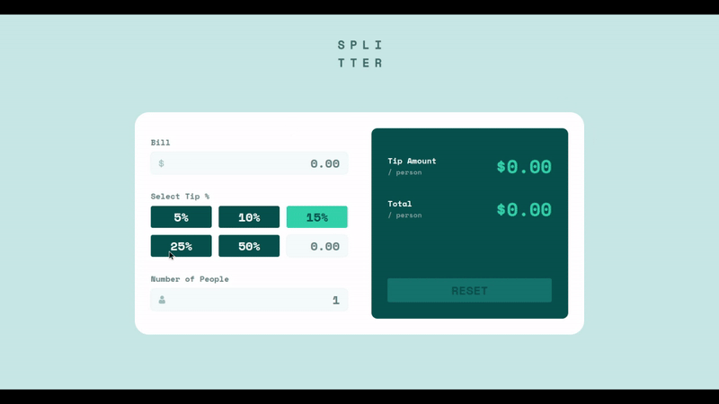
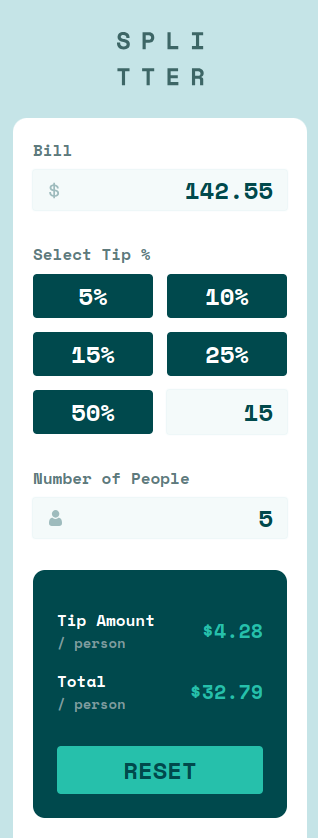
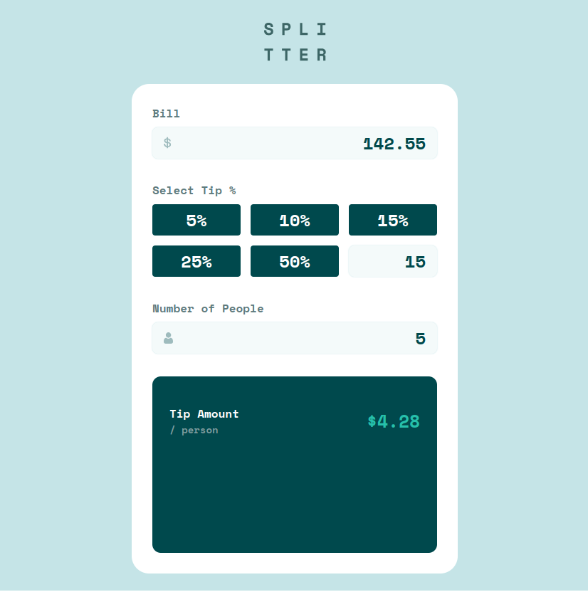

<div align="center">

  <h1 align="center">Tip Calculator App</h1>

  <p align="center">
    A responsive tip calculator with real-time updates, accessible validation, and support for custom tip percentages - built as a <a href="https://www.frontendmentor.io/challenges/tip-calculator-app-ugJNGbJUX"><strong>Frontend Mentor</strong></a> challenge.
    <br /><br />
    <a href="https://alberto-rj.github.io/tip-calculator"><strong>View Live</strong></a>
    &nbsp;&nbsp;|&nbsp;&nbsp;
    <a href="https://github.com/alberto-rj/tip-calculator/issues">Report a Bug</a>
  </p>

  <br />

  <a href="https://www.frontendmentor.io/profile/alberto-rj">
    
  </a>
  &nbsp;
  
  &nbsp;
  <a href="https://www.frontendmentor.io/challenges?difficulties=1">
    
  </a>

</div>

<br />



<br />

## About the Project

This tip calculator lets users split a bill across a group, choosing from preset tip percentages or entering a custom value. All results update instantly as inputs change. The focus of this build was not just the calculation logic, but getting the **accessible validation**, **keyboard navigation**, and **responsive layout** right - things that are easy to skip but make a real difference to users.

**Stack:** HTML5 · Sass · JavaScript · Git

<br />

## Key Technical Decisions

**Sass over plain CSS** - The design has a clearly defined color palette and spacing system. Using Sass variables and partials kept the styles consistent and made global changes (like adjusting the focus ring color for accessibility) a one-line update instead of a find-and-replace across files.

**Vanilla JS over a framework** - For a single-purpose calculator with no routing or shared state, a framework would have added complexity without benefit. Plain JS kept the bundle size at zero and forced a clearer separation between DOM manipulation and the calculation logic.

**`focus-visible` over `focus`** - Using `:focus-visible` instead of `:focus` means keyboard users get clear focus rings while mouse users don't see them on click. A small detail that significantly improves the experience for both groups.

<br />

## Challenges & What I Learned

- **Accessible validation without a framework:** The hardest part wasn't the calculation - it was making the error states work correctly for screen reader users. I had to use `aria-live` regions and `aria-describedby` to connect error messages to their inputs, so assistive technology announces them at the right moment. I initially handled this only visually and only caught the gap during manual testing with VoiceOver.

- **Floating point precision:** `0.1 + 0.2 === 0.30000000000000004` in JavaScript. Tip calculations exposed this quickly. I solved it by rounding results to two decimal places at the display layer using `toFixed(2)`, rather than trying to handle precision in the calculation itself - which kept the logic clean.

- **What I'd do differently:** I'd write the calculation logic as pure functions from the start and test them in isolation before connecting them to the DOM. I ended up with calculation and DOM code mixed together, which made debugging edge cases (like a `0` number of people) harder than it needed to be. Separating concerns earlier would have saved time.

<br />

## Screenshots

<details>
<summary><strong>Mobile</strong></summary>
<br />

</details>

<details>
<summary><strong>Tablet</strong></summary>
<br />

</details>

<br />

## Running Locally

```bash
git clone https://github.com/alberto-rj/tip-calculator.git
cd tip-calculator
```

Then open `index.html` directly in your browser, or use the [Live Server](https://marketplace.visualstudio.com/items?itemName=ritwickdey.LiveServer) extension in VS Code for hot reload.

No build step, no dependencies to install.

<br />

## Author

- GitHub - [@alberto-rj](https://github.com/alberto-rj)
- Frontend Mentor - [@alberto-rj](https://www.frontendmentor.io/profile/alberto-rj)
- Twitter - [@albertorauljose](https://twitter.com/albertorauljose)

<br />

---

Challenge by [Frontend Mentor](https://www.frontendmentor.io).
